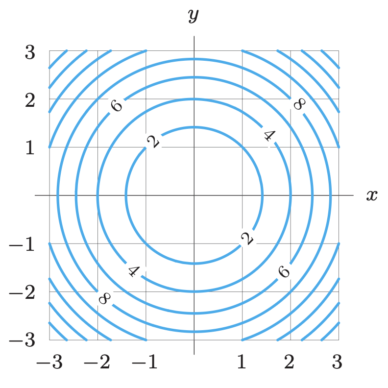

## Gradients {.scrollable}

::: {.callout-note icon="false" .fragment }
## Definition

Let $f: \mathbb{R}^n \to \mathbb{R}$ be a differentiable function. The **gradient** of $f$ at a point $\mathbf{v} \in \mathbb{R}^n$, denoted $\nabla f(\mathbf{v})$, is the vector in $\mathbb{R}^n$ for which

$$
f'(\mathbf{v})\mathbf{h} = \langle \nabla f(\mathbf{v}), \mathbf{h} \rangle
$$

for all step vectors $\mathbf{h} \in \mathbb{R}^n$.
:::

- If $x_1,x_2,\ldots,x_n$ are the variables in $\mathbb{R}^n$, then we know that:
$$
f'(\mathbf{v}) = \begin{bmatrix} \displaystyle\frac{\partial f}{\partial x_1}(\mathbf{v}) & \displaystyle\frac{\partial f}{\partial x_2}(\mathbf{v}) & \cdots & \displaystyle\frac{\partial f}{\partial x_n}(\mathbf{v}) \end{bmatrix}.
$$
If for each $i=1,2,\ldots,n$ we let $\mathbf{h}$ be the standard basis vector $\mathbf{e}_i$, then this leads us to:

::: {.callout-note icon="false" .fragment }
## How do you compute the gradient?

The gradient of a function $f: \mathbb{R}^n \to \mathbb{R}$ at a point $\mathbf{v} \in \mathbb{R}^n$ is given by
$$
\nabla f(\mathbf{v}) = \begin{bmatrix} \displaystyle\frac{\partial f}{\partial x_1}(\mathbf{v}) \\ \displaystyle\frac{\partial f}{\partial x_2}(\mathbf{v}) \\ \vdots \\ \displaystyle\frac{\partial f}{\partial x_n}(\mathbf{v}) \end{bmatrix}.
$$

:::

## Exercise 1: Computing gradients {.scrollable}

::: {.callout-note icon="false" .nonincremental appearance="minimal"}

a. Compute the gradient of the function
$$
f: \mathbb{R}^2 \to \mathbb{R}, \quad f(x,y) = y\ln{x} +xy^2
$$
at the point $(1,2)$.

b. Compute the gradient of the function
$$
f: \mathbb{R}^2 \to \mathbb{R}, \quad f(x,y) = \ln(x^2+xy)
$$
at the point $(4,1)$.

c. Compute the gradient of the function
$$
f: \mathbb{R}^3 \to \mathbb{R}, \quad f(x,y,z) = xy+z
$$
at the point $(-1,0,1)$.

d. Compute the gradient of the function
$$
f: \mathbb{R}^3 \to \mathbb{R}, \quad f(x,y,z) = \frac{yz^2}{1+x^2}
$$
at the point $(1,2,3)$.

:::

## Properties of the gradient in two dimensions {.scrollable}

- Let $f: \mathbb{R}^2 \to \mathbb{R}$ be a differentiable function, $\mathbf{v}$ a point, and $\mathbf{h}$ a **unit** step vector. Then we know that
$$
f'(\mathbf{v})\mathbf{h} = \langle \nabla f(\mathbf{v}), \mathbf{h} \rangle = \|\nabla f(\mathbf{v})\| \cdot \|\mathbf{h}\| \cos{\theta} = \|\nabla f(\mathbf{v})\| \cos{\theta},
$$
where $\theta$ is the angle (with $0\leq \theta \leq \pi$) between $\nabla f(\mathbf{v})$ and $\mathbf{h}$.

- From this follows:

::: {.callout-note icon="false" .fragment }
## Properties in two dimensions

Let $f: \mathbb{R}^2 \to \mathbb{R}$ be a differentiable function, $\mathbf{v}$ a point, and $\mathbf{h}$ a **unit** step vector. Suppose that the gradient of $f$ at $\mathbf{v}$ is nonzero. Then:

a. The value of $f'(\mathbf{v})\mathbf{h}$ is largest when $\mathbf{h}$ points in the same direction as $\nabla f(\mathbf{v})$. In other words, the gradient $\nabla f(\mathbf{v})$ points in the direction of greatest rate of increase of $f$ at $\mathbf{v}$.

b. The value of $f'(\mathbf{v})\mathbf{h}$ is smallest when $\mathbf{h}$ points in the opposite direction as $\nabla f(\mathbf{v})$. In other words, the vector $-\nabla f(\mathbf{v})$ points in the direction of greatest rate of decrease of $f$ at $\mathbf{v}$.

c. The gradient vector $\nabla f(\mathbf{v})$ is orthogonal to the contour of $f$ that passes through $\mathbf{v}$.
:::

## Exercise 2: Gradients, derivatives, and contours {.scrollable}

::: {.callout-note icon="false" .nonincremental appearance="minimal"}

Use the contour diagram of $f$ shown below to determine whether the derivative at the indicated point in the indicated direction is positive, negative, or zero. What can you say about the gradient at the indicated points?

{fig-align="center" width="50%"}

a. At $(-2,2)$ in the direction of $\mathbf{e}_1$.
b. At $(0,-2)$ in the direction of $\mathbf{e}_2$.
c. At $(0,-2)$ in the direction of $\mathbf{e}_1 + 2 \mathbf{e}_2$.
d. At $(0,-2)$ in the direction of $\mathbf{e}_1 - 2 \mathbf{e}_2$.
e. At $(-1,1)$ in the direction of $\mathbf{e}_1 + \mathbf{e}_2$.
f. At $(-1,1)$ in the direction of $-\mathbf{e}_1 + \mathbf{e}_2$.

:::

## Properties of the gradient in three dimensions {.scrollable}

- Turns out, the same properties of gradients in two dimensions also hold in three dimensions:

::: {.callout-note icon="false" .fragment }
## Properties in three dimensions

Let $f: \mathbb{R}^3 \to \mathbb{R}$ be a differentiable function, $\mathbf{v}$ a point, and $\mathbf{h}$ a **unit** step vector. Suppose that the gradient of $f$ at $\mathbf{v}$ is nonzero. Then:

a. The value of $f'(\mathbf{v})\mathbf{h}$ is largest when $\mathbf{h}$ points in the same direction as $\nabla f(\mathbf{v})$. In other words, the gradient $\nabla f(\mathbf{v})$ points in the direction of greatest rate of increase of $f$ at $\mathbf{v}$.

b. The value of $f'(\mathbf{v})\mathbf{h}$ is smallest when $\mathbf{h}$ points in the opposite direction as $\nabla f(\mathbf{v})$. In other words, the vector $-\nabla f(\mathbf{v})$ points in the direction of greatest rate of decrease of $f$ at $\mathbf{v}$.

c. The gradient vector $\nabla f(\mathbf{v})$ is normal to the level surface of $f$ that passes through $\mathbf{v}$.
:::

## Exercise 3: Gradients, derivatives, and level surfaces {.scrollable}

::: {.callout-note icon="false" .nonincremental appearance="minimal"}

a. Suppose $f (x, y, z) = x^2 + y^2$. Describe the direction of the vector $\nabla f(0,1,1)$ without
actually computing it.

b. Find a unit vector in the direction of greatest rate of increase of the function $f (x, y, z) = xy + z^2$ at the point $(2, 3, 4)$.

c. Find a normal vector to the graph of the function  $f(x,y) = x^2 + y^2$ at the point $(−1, 1, 2)$.

:::